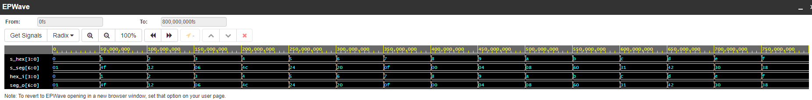

# Lab 4: Vojtěch Peška

### Seven-segment display decoder

1. Listing of VHDL stimulus process from testbench file (`tb_hex_7seg.vhd`) with asserts. Verify all input combinations. Always use syntax highlighting, meaningful comments, and follow VHDL guidelines:

```vhdl
    p_stimulus : process
    begin
        report "Stimulus process started" severity note;

        -- First test case
        s_hex <= "0000"; wait for 50 ns;
        assert (s_seg = "0000001")
        report "Input combination 0000 FAILED" severity error;


        -- WRITE OTHER TEST CASES HERE
	 s_hex <= "0001"; wait for 50 ns;
        assert (s_seg = "1001111")
        report "Input combination 0001 FAILED" severity error;
        
        s_hex <= "0010"; wait for 50 ns;
        assert (s_seg = "0010010")
        report "Input combination 0010 FAILED" severity error;
        
        s_hex <= "0011"; wait for 50 ns;
        assert (s_seg = "0000110")
        report "Input combination 0011 FAILED" severity error;
        
        s_hex <= "0100"; wait for 50 ns;
        assert (s_seg = "1001100")
        report "Input combination 0100 FAILED" severity error;
        
        s_hex <= "0101"; wait for 50 ns;
        assert (s_seg = "0100100")
        report "Input combination 0101 FAILED" severity error;
        
        s_hex <= "0110"; wait for 50 ns;
        assert (s_seg = "0100000")
        report "Input combination 0110 FAILED" severity error;
        
        s_hex <= "0111"; wait for 50 ns;
        assert (s_seg = "0001111")
        report "Input combination 0111 FAILED" severity error;
        
        s_hex <= "1000"; wait for 50 ns;
        assert (s_seg = "0000000")
        report "Input combination 1000 FAILED" severity error;
        
        s_hex <= "1001"; wait for 50 ns;
        assert (s_seg = "0000100")
        report "Input combination 1001 FAILED" severity error;
        
        s_hex <= "1010"; wait for 50 ns;
        assert (s_seg = "0001000")
        report "Input combination 1010 FAILED" severity error;
        
        s_hex <= "1011"; wait for 50 ns;
        assert (s_seg = "1100000")
        report "Input combination 1011 FAILED" severity error;
        
        s_hex <= "1100"; wait for 50 ns;
        assert (s_seg = "0110001")
        report "Input combination 1100 FAILED" severity error;
        
        s_hex <= "1101"; wait for 50 ns;
        assert (s_seg = "1000010")
        report "Input combination 1101 FAILED" severity error;
        
        s_hex <= "1110"; wait for 50 ns;
        assert (s_seg = "0110000")
        report "Input combination 1110 FAILED" severity error;
        
        s_hex <= "1111"; wait for 50 ns;
        assert (s_seg = "0111000")
        report "Input combination 1111 FAILED" severity error;

        report "Stimulus process finished" severity note;
        wait;
    end process p_stimulus;
```

2. Screenshot with simulated time waveforms. Always display all inputs and outputs (display the inputs at the top of the image, the outputs below them) at the appropriate time scale!

   

### LED(7:4) indicators

1. Listing of LEDs(7:4) part of VHDL architecture from source file `top.vhd`. Try to write logic functions as simple as possible. Always use syntax highlighting, meaningful comments, and follow VHDL guidelines:

   | **Hex** | **Inputs** | **LED4** | **LED5** | **LED6** | **LED7** |
   | :-: | :-: | :-: | :-: | :-: | :-: |
   | 0 | 0000 | 1 | 0 | 0 | 0 |
   | 1 | 0001 | 0 | 0 | 1 | 1 |
   | 2 | 0010 | 0 | 0 | 0 | 1 |
   | 3 | 0011 | 0 | 0 | 1 | 0 |
   | 4 | 0100 | 0 | 0 | 0 | 1 |
   | 5 | 0101 | 0 | 0 | 1 | 0 |
   | 6 | 0110 | 0 | 0 | 0 | 0 |
   | 7 | 0111 | 0 | 0 | 1 | 0 |
   | 8 | 1000 | 0 | 0 | 0 | 1 |
   | 9 | 1001 | 0 | 0 | 1 | 0 |
   | A | 1010 | 0 | 1 | 0 | 0 |
   | b | 1011 | 0 | 1 | 1 | 0 |
   | C | 1100 | 0 | 1 | 0 | 0 |
   | d | 1101 | 0 | 1 | 1 | 0 |
   | E | 1110 | 0 | 1 | 0 | 0 |
   | F | 1111 | 0 | 1 | 1 | 0 |

   ```vhdl
   --------------------------------------------------------------------
   -- Experiments on your own: LED(7:4) indicators

   -- Turn LED(4) on if input value is equal to 0, ie "0000"
   	LED(4) <= '0' when (hex_i <= "0000")else
		'1' when others

   -- Turn LED(5) on if input value is greater than "1001", ie 10, 11, 12, ...
   	LED(5) <= '0' when (hex_i <= "1001")
		'1' when others

   -- Turn LED(6) on if input value is odd, ie 1, 3, 5, ...
	LED(6) <= '0' when (hex_i = "0001")else
		'0' when (hex_i = "0011")else
		'0' when (hex_i = "0101")else
		'0' when (hex_i = "0111")else
		'0' when (hex_i = "1001")else
		'0' when (hex_i = "1011")else
		'0' when (hex_i = "1101")else
		'0' when (hex_i = "1111")else
		'1' when others

   -- Turn LED(7) on if input value is a power of two, ie 1, 2, 4, or 8
   	LED(7) <= '1' when (hex_i = "0001")else
		'1' when (hex_i = "0010")else
		'1' when (hex_i = "0100")else
		'1' when (hex_i = "1000")else
		'0' when others
   ```