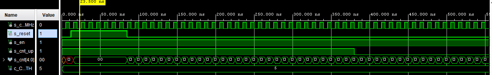
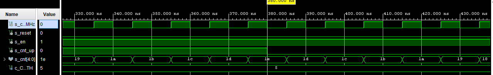
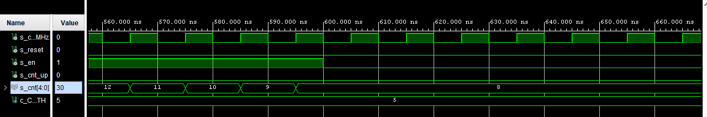
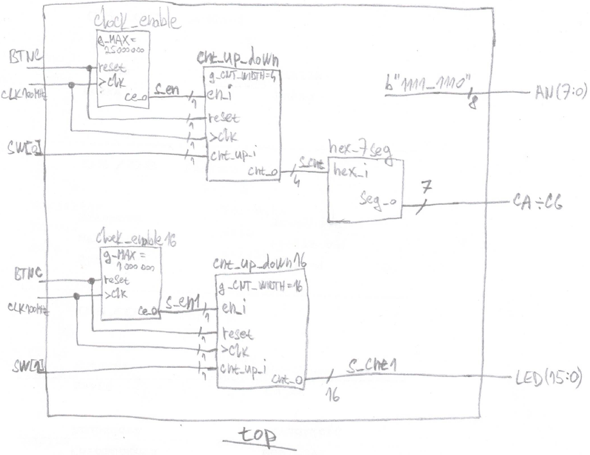

<<<<<<< HEAD
# Lab 6: YOUR_FIRSTNAME LASTNAME
=======
# Lab 6: Vojtěch Peška
>>>>>>> b501d36d3370304531c2426a2716b6a4226d810d

### Bidirectional counter

1. Listing of VHDL code of the completed process `p_cnt_up_down`. Always use syntax highlighting, meaningful comments, and follow VHDL guidelines:

```vhdl
    --------------------------------------------------------
    -- p_cnt_up_down:
    -- Clocked process with synchronous reset which implements
    -- n-bit up/down counter.
    --------------------------------------------------------
    p_cnt_up_down : process(clk)
    begin
        if rising_edge(clk) then
        
            if (reset = '1') then   -- Synchronous reset
                s_cnt_local <= (others => '0'); -- Clear all bits

            elsif (en_i = '1') then -- Test if counter is enabled
<<<<<<< HEAD

                -- TEST COUNTER DIRECTION HERE

                    s_cnt_local <= s_cnt_local + 1;
=======
                if (cnt_up_i = '1') then
                    s_cnt_local <= s_cnt_local + 1;
                else
                    s_cnt_local <= s_cnt_local - 1;
                end if;

>>>>>>> b501d36d3370304531c2426a2716b6a4226d810d
            end if;
        end if;
    end process p_cnt_up_down;
```

2. Screenshot with simulated time waveforms. Test reset as well. Always display all inputs and outputs (display the inputs at the top of the image, the outputs below them) at the appropriate time scale!

<<<<<<< HEAD
   
=======
	RESET (s_reset) ->
   

	ZMĚNA SMĚRU ČÍTÁNÍ (s_cnt_up) ->
   

	ZMĚNA PŘI ZMĚNĚ SIGNÁLU "ENABLE" (s_en) ->
   
>>>>>>> b501d36d3370304531c2426a2716b6a4226d810d

### Two counters

1. Image of the top layer structure including both counters, ie a 4-bit bidirectional counter from *Part 4* and a 16-bit counter with a 10 ms time base from *Experiments on your own*. The image can be drawn on a computer or by hand. Always name all inputs, outputs, components and internal signals!

<<<<<<< HEAD
   
=======
   
>>>>>>> b501d36d3370304531c2426a2716b6a4226d810d
